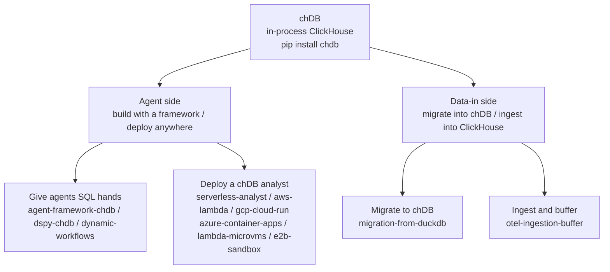
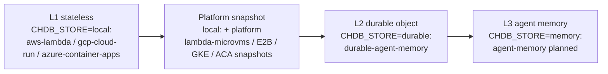

# chDB Cookbook

Runnable notebooks and code samples for [chDB](https://github.com/chdb-io/chdb) — the in-process OLAP SQL engine powered by ClickHouse.

Short, focused, runnable examples that show one technique each — organized by **goal** (build an agent, deploy an analyst, migrate, ingest), not by API surface. This page is the map: what each recipe is for, and how the stories relate.

## The map

chDB is one thing — a full ClickHouse query engine inside your process (`pip install chdb`) over local files, S3, Postgres, MySQL, ClickHouse, and DataFrames. The recipes split into two sides: the agent side, where chDB becomes a tool or deployed analyst, and the data-in side, where data is moved, enriched, or buffered.



The two agent paths are **orthogonal and compose**: the `execute_sql` tool in the deploy recipes is the same `chdb.agents.ChDBTool` wrapped by the framework recipes. Migration and ingestion are the data-in side and can feed any of the agent or deploy patterns above.

## Recipes by goal

### Give an agent SQL hands — chDB as a tool in your framework
The engine runs inside the agent's process, so the agent needs exactly one tool. Same `chdb.agents.ChDBTool` underneath; one adapter per framework.
- [chDB tools for Microsoft Agent Framework](agent-framework-chdb/README.md) — `FunctionTool`s over `chdb.agents.ChDBTool`; schemas come from the package, nothing hand-maintained.
- [chDB tools for DSPy](dspy-chdb/README.md) — typed callables for `dspy.ReAct`; one copyable file, no package needed.
- [Federated SQL for Claude Dynamic Workflows](dynamic-workflows/README.md) — give every subagent a federated chDB query that joins S3, Postgres, ClickHouse, an HTTP API, and a DataFrame in one statement, no server to stand up.

### Deploy a chDB analyst — serverless, and how far state lives
One app (`chdb-serverless`, the ~50-line analyst); one line, the store seam, decides how far state survives.
- [One analyst, three clouds](serverless-analyst/README.md) — **the series hub**: the `chdb-serverless` package as one image on AWS Lambda, Cloud Run, and Azure Container Apps, cold-start economics side by side, and where stateful lives.
- [on AWS Lambda](aws-lambda/README.md) — classic Lambda container function: per-request billing, Function URL (IAM-auth by default).
- [on Google Cloud Run](gcp-cloud-run/README.md) — scale-to-zero container: idle = free, private by default.
- [on Azure Container Apps](azure-container-apps/README.md) — scale-to-zero: server-side ACR build, internal ingress by default.
- [on AWS Lambda MicroVMs](lambda-microvms/README.md) — a **private, warm** analyst per user: snapshot-hot starts, suspend/resume with memory intact, one Firecracker MicroVM per session.
- [in an E2B sandbox](e2b-sandbox/README.md) — the sandbox is the agent's stateful computer: a prebuilt public `chdb` template, 1M rows surviving `pause()`/resume sub-second both ways, and `ChDBTool` wired into a tool-use loop.
- [Durable local agent memory with chDB](durable-agent-memory/README.md) — the missing middle store tier: embedded chDB/MergeTree for hot analytical reads, object storage for recoverable state, no database server or sidecar required.

Use this ladder when choosing a deployment target. Climb a rung only when the use case needs it.



| Rung | Choose it when | Recipes |
|---|---|---|
| L1 stateless | You can rebuild or reload state on each instance, and scale-to-zero is the priority. | [aws-lambda](aws-lambda/README.md) / [gcp-cloud-run](gcp-cloud-run/README.md) / [azure-container-apps](azure-container-apps/README.md) |
| Platform snapshot | One platform is enough and you want a warm in-process engine to survive suspend/resume. This still runs `local:`. | [lambda-microvms](lambda-microvms/README.md) / [e2b-sandbox](e2b-sandbox/README.md) today; GKE / ACA snapshot patterns |
| L2 durable object | State must move across hosts or clouds, live in storage you own, or be queried across many objects. | [durable-agent-memory](durable-agent-memory/README.md) |
| L3 agent memory | The analyst needs memory semantics over durable analytical state. | `agent-memory` planned |

> **Platform snapshot is not a store tier** — it keeps `local:` state by snapshotting the whole box (Firecracker snapshot, E2B `pause`, GKE Pod snapshot). L2/L3 move state out into storage you own, so it can be portable and federated across objects.

### Migrate to chDB
- [Migrating from DuckDB to chDB](migration-from-duckdb/README.md) — runnable companion to the migration guide: the analyzer and an 18-query benchmark, including where a chDB `MergeTree` design choice trades off vs DuckDB.

### Ingest & buffer
- [OTEL ingestion buffer in Node.js](otel-ingestion-buffer/README.md) — chDB as an off-heap ingestion buffer: read length-delimited protobuf off S3, enrich, and export to ClickHouse over the native protocol in one SQL statement — the rows never pass through JavaScript.

## Getting started

```bash
pip install chdb jupyter
git clone https://github.com/chdb-io/cookbook
cd cookbook
jupyter lab
```

Every runnable recipe runs end-to-end with `pip install chdb` and the dependencies listed in its README/first cell — no external services required except where a recipe explicitly federates to ClickHouse Cloud, deploys to a cloud, or uses object storage for durable state.

## Conventions

- Recipes are self-contained — the first step installs everything, the last prints expected output.
- All datasets are public (S3 open buckets, Hugging Face, or pip-installed fixtures).
- Each recipe has a 1-paragraph "What you'll learn" header and a "Try next" footer.
- File names use kebab-case; categories are goals, not API surfaces.

## Contributing

PRs welcome. To propose a recipe:

1. Open an issue with the working title and a one-paragraph summary of what it teaches.
2. Place it under the matching goal, and add a one-line entry to the map above.
3. Ensure it runs top-to-bottom on a clean `pip install chdb` environment.

For larger contributions (new categories, multi-recipe tutorials), please discuss in [Discord](https://discord.gg/D2Daa2fM5K) first.

## License

Apache 2.0 — see [LICENSE](LICENSE).

## Related

- Main chDB repository: https://github.com/chdb-io/chdb
- chDB documentation: https://clickhouse.com/docs/chdb
- LLM-friendly index: https://clickhouse.com/docs/chdb/llms.txt
- Awesome chDB: https://github.com/chdb-io/awesome-chdb
- Community: https://discord.gg/D2Daa2fM5K
