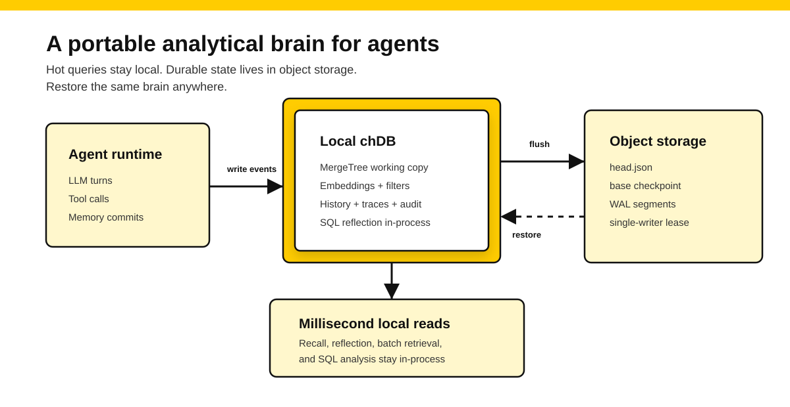
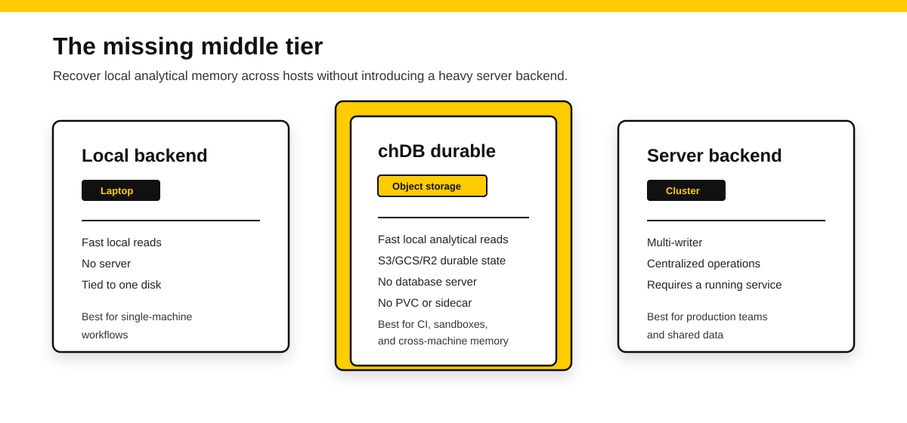
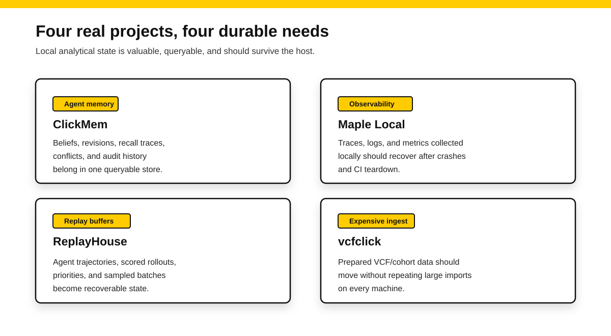

# Durable local agent memory with chDB

**What you'll learn:** use chDB durable as a middle store tier for local-first agents and analytical applications: hot queries run against an embedded ClickHouse engine, while recoverable state lives in object storage you own.



Agents are starting to look less like one-off API calls and more like small, long-running systems.

They pause. They resume. They call tools. They make mistakes. They revise what they know. They need to remember project rules, user preferences, failed attempts, useful traces, and the evidence behind previous decisions.

That creates a practical question for builders:

Where should all this state live?

For many projects, the first answer is SQLite. And that is a good answer. SQLite is small, serverless, transactional, reliable, and easy to embed. LangGraph makes this pattern familiar: `SqliteSaver` and `AsyncSqliteSaver` are useful for local experimentation and lightweight workflows, while production deployments often move toward Postgres-backed checkpointers and stores.

So the point is not that the industry lacks durable state.

The point is that agent memory eventually stops being only a durable-state problem.

It becomes an analytical problem.

How was a memory created? Which memories were recalled? Which belief replaced an older one? Did a failed tool call lead to a bad memory? Which project rules helped the agent avoid repeated mistakes over the past month? Which traces explain why an agent made a decision?

Those questions are not just key-value lookups. They are history queries: filtering, grouping, ranking, joining, auditing, and batch retrieval.

In other words, they are OLAP-shaped.

chDB puts the ClickHouse analytical engine inside the agent's local process. In [chDB as the Agent's Local Data Engine](https://clickhouse.com/blog/chdb-agents-local-data-engine), we described the same direction around memory, traces, and conversation history: they are naturally append-heavy, queryable datasets. Vector search is useful, but it is only one index. A real memory system also needs filters, revisions, audit trails, exports, aggregates, and joins with the rest of the data an agent sees.

A compact way to describe chDB for local agent memory is:

- MergeTree for compression.
- Efficient batch retrieval.
- Embeddings as an index.
- Easy transfer of local data to ClickHouse, Postgres, S3, or even CSV.

chDB is not trying to beat SQLite at being a tiny local state file. SQLite is already excellent at that.

chDB becomes valuable when local state turns into local analytical state: memory, traces, events, embeddings, revisions, and prepared datasets that the agent needs to query.

chDB durable adds the missing part: that local analytical brain should not disappear with one machine.

## API shape



chDB durable is an addressable, single-writer, recoverable embedded analytical object.

Install chDB with the durable extra before using an object-storage backend:

```bash
pip install "chdb[durable]"
```

A Python developer can open one like this:

```python
from chdb import durable as cd

ns = cd.Namespace("s3://my-bucket/agent-memory", owner="worker-1")
brain = ns.open("user-123")

brain.execute("INSERT INTO mem.beliefs VALUES (...)")
brain.flush()
brain.checkpoint()
brain.close()
```

The shape is intentionally simple:

- Queries run against a local chDB / MergeTree working copy, without a remote database round trip.
- Authoritative state lives in object storage you own, such as S3, GCS, Azure Blob, R2, or MinIO.
- `flush()` is an explicit durability boundary: when it returns, recent writes have reached object storage.
- `checkpoint()` folds the current state into a fresh base snapshot, so future opens do not need to replay a long log.
- `head.json` plus object-store conditional writes provide a single-writer lease and fencing, so two processes cannot silently corrupt the same embedded database.

This is not a general multi-writer OLTP database. It is not a replacement for Postgres.

It is the middle deployment shape between two familiar choices:

- A local backend that is fast and simple, but tied to one disk.
- A server backend that is durable and shared, but comes with a running service, network calls, and operational weight.

chDB durable fits the space in between. When a user wants personal or project memory to live in their own object storage, recover across machines, CI jobs, and sandboxes, but does not want to introduce a heavy server backend, the durable backend is a natural fit.

## Four real projects, four durable needs



- [ClickMem](https://github.com/auxten/clickmem): agent memory

  ClickMem is not a "chat history vector database." It is an explicit memory safe: memories must be deliberately committed; raw transcripts stay as cold evidence; memories can be revised, forgotten, pinned, or blacklisted; semantically close but conflicting memories are surfaced instead of silently polluting future context.

  That kind of system is not a simple key-value store. It has memories, memory history, raw transcripts, events, scopes, tags, privacy controls, conflict queues, and recall traces.

  For ClickMem-like systems, chDB durable is not "another storage backend." It is a way to make the local analytical memory portable. The hot path stays embedded. The durable copy lives in object storage. The same memory can be restored on another laptop, in CI, or inside a short-lived sandbox.

- [Maple Local](https://maple.dev/docs/local-mode/): local-first observability

  Maple Local represents a second category: local-first observability. It receives traces, logs, and metrics, embeds chDB, and provides local querying and dashboards.

  In this kind of application, embedded chDB is no longer a disposable cache. It is the user's local observability database. Once it contains telemetry that took time to collect, durability becomes a product concern: crash recovery, dirty-store recovery, checkpointing, schema migration, and restore behavior all matter.

  chDB durable moves that recovery pattern into a reusable database-level primitive. Object storage becomes the authoritative state, while the application decides when to flush, when to checkpoint, and how to name each analytical object.

- [ReplayHouse](https://github.com/jaymebrd/replayhouse): buffer and training state

  ReplayHouse is a replay buffer built on ClickHouse, with an embedded chDB backend for local work. Its core loop is a good match for analytical durability: store agent trajectories, transitions, and scored rollouts; sample weighted training batches; write training errors back as priorities; and query the exact rows the trainer consumed.

  That is durable state hiding in plain sight. A replay buffer is not just cache. It can contain expensive experience collected over long runs, priority updates, sampled batches, versions, and intermediate training signals.

  With chDB durable, the buffer can be flushed by batch, epoch, or training milestone. If the run moves from a laptop to CI, from CI to a training box, or from one sandbox to another, the local analytical buffer can move with it. And because the buffer is still chDB, developers can inspect sampling distribution, priority drift, repeated states, and historical training behavior with SQL.

- [vcfclick](https://github.com/nuin/vcfclick): expensive ingest and ready-to-query data

  vcfclick represents a fourth category: data import and preparation. Its repository describes a research-bioinformatics VCF database using an embedded ClickHouse engine, embedded DuckDB annotations, and an MCP natural-language layer.

  For this class of project, durable is not mainly about protecting the only copy of the raw data. The raw VCF files may already live somewhere else. The expensive part is the prepared analytical state: imported data, normalized layout, annotations, indexes, and a ready-to-query working set.

  Without a durable checkpoint, each machine may need to repeat the import. With chDB durable, a prepared cohort database can be checkpointed to object storage and restored later as a local chDB query replica.

## How developers usually handle durable state today

There are several good answers already. chDB durable only makes sense if we are clear about what those answers do well.

SQLite checkpointers and stores are the most common local starting point. In LangGraph, a checkpointer such as `SqliteSaver` persists graph execution state so an agent can resume. A store, such as `BaseStore`, gives the application a place to keep cross-thread or semantic memory. This is practical and mature. But the job is mainly durable application state, not local analytical computation over memory history, traces, embeddings, and event streams.

SQLite plus Litestream is another strong pattern. Litestream continuously replicates SQLite WAL data to object storage. In Kubernetes, that often pairs with a StatefulSet, a PersistentVolumeClaim, a restore init container, and a Litestream sidecar. It is a good backup and recovery architecture, but the application is still operating a SQLite database plus a replication process.

Postgres, pgvector, ClickHouse, and managed memory services are the right answer for many team-scale deployments. They support shared access, central operations, and multi-user production workflows. The tradeoff is that the agent now depends on a remote service, network calls, connection management, and platform operations.

Stateful serverless platforms, such as Cloudflare Durable Objects, provide another elegant model: each object has identity, single-threaded execution, and durable storage. The tradeoff is platform coupling, and the storage model is still oriented toward application state rather than embedded OLAP.

chDB durable sits next to these approaches, not above them.

It offers a different combination:

- Embedded OLAP compute.
- Object-storage durability.
- No database server.
- No Kubernetes PVC.
- No replication sidecar.
- Local analytical reads over a recoverable working copy.

## Why chDB durable is more than another provider

If all you need is "save this checkpoint," SQLite may already be enough.

If you need "let an agent query its own long-term memory, traces, revisions, embeddings, and event streams locally, and restore that analytical state across machines," chDB durable becomes a different tool.

The distinction matters.

Adding a new backend provider is only interesting if it adds a capability the existing providers do not naturally provide. chDB durable adds a new deployment shape:

- Local compute: hot queries stay in the agent process.
- Analytical layout: MergeTree is built for compressed append-heavy history, batch retrieval, filtering, aggregation, and vector-assisted search.
- Portable durability: object storage holds the authoritative copy, so state can recover across machines, CI jobs, and sandboxes.
- Explicit control: the application chooses when to flush and when to checkpoint.
- Operational simplicity: no database server, no PVC, and no sidecar replication process.

Put more simply:

SQLite durability helps keep local state from disappearing.

chDB durable helps keep local analytical state from disappearing, while still letting the agent analyze it.

## What comes next

Today, chDB durable is available on the Python side, which makes it suitable for early validation in agent memory, replay buffers, prepared cohort databases, and local observability collectors.

The next step is to make durable a stable cross-language capability:

1. Freeze the durable protocol: object layout, `head.json`, checkpoints, WAL, CAS semantics, leases, errors, and conformance fixtures.
2. Move the minimal engine primitives into `chdb-core`: backup, restore, and SQL classification, so bindings do not need to guess query behavior with string matching. Expose those APIs through `libchdb.so`, so Python, Node/Bun/Deno, Go, Rust, and other bindings can share the same durable primitives from the core library.
3. Keep Python as the reference implementation.
4. Provide the same durable semantics through Node/Bun/Deno, Go, Rust, and other language bindings over time.

The boundaries are important. chDB durable is single-writer. The V1 WAL requires deterministic write statements for replay. Multi-writer team collaboration should still use ClickHouse, Postgres, or another server-backed database when that is the right architecture.

But for the growing class of local-first, agent-first, and serverless-first applications, the missing middle tier is compelling:

no database server, no Kubernetes PVC, no sidecar replication process, and still a fast embedded analytical database whose state can survive the host.

The future of agent memory may not be a bigger context window.

It may be a local analytical brain that knows how to survive.

## Try next

- Try the Python durable API with a small per-user or per-project namespace.
- Model agent memory as append-heavy analytical tables: memories, memory history, raw evidence, recall traces, conflicts, and tool events.
- Flush after meaningful batches, checkpoint after compaction points, and keep object names scoped to one writer.
- If you have suggestions, use cases, or ideas to discuss around chDB durable, open a discussion issue in the [chdb-io/chdb](https://github.com/chdb-io/chdb/issues) repository.
