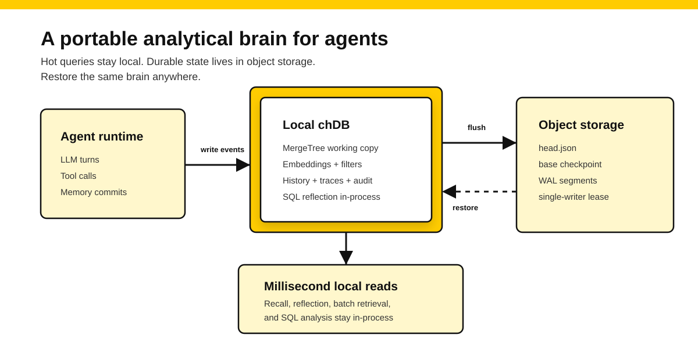
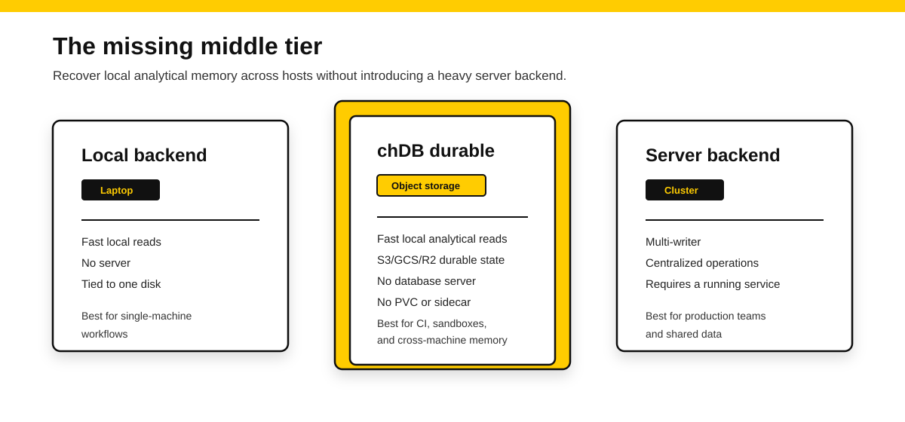
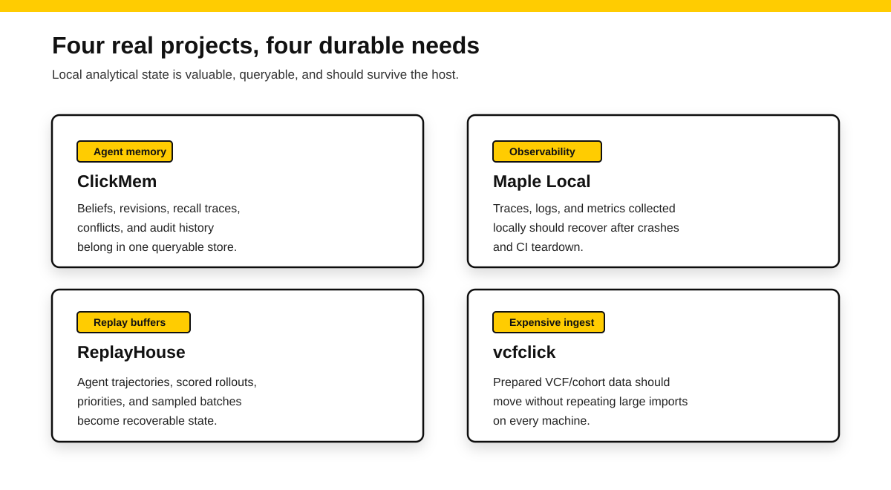

# Durable local agent memory with chDB

**What you'll learn:** why local agent memory turns into an analytics problem, how the usual durability options (SQLite, Litestream, Postgres, Durable Objects, DuckDB) fit and where they stop, and how chDB durable keeps hot queries in-process while the authoritative copy lives in object storage you own. Includes best practices, SQL straight over raw JSONL transcripts, and a worked example from [ClickMem](https://github.com/auxten/clickmem).



## The state that didn't come back

Here is how it started for us.

We were building agent memory on top of chDB. A coding agent ran for weeks on one laptop, and the embedded database quietly filled up: project rules, user preferences, decisions that had been revised twice, the raw transcripts behind those decisions, and a trail of which memories had been recalled for which task. It was a good setup. Recall was a local query. Nothing left the machine.

Then the work moved. A CI job needed the same memory. A sandbox spun up, did an hour of useful work, and was torn down. A second laptop showed up. Every time, the answer was the same: the memory lived in one MergeTree directory on one disk, and the disk was somewhere else.

The obvious fix is "use a database with a server." That fixes portability and breaks everything we liked. Recall goes back over the network. Every tool call pays a round trip. We now run, or rent, a service to hold what used to be a directory.

The second obvious fix is "just use SQLite." SQLite is excellent at being a durable local state file, and nearly every agent framework ships a SQLite-backed checkpointer or memory store, so the pattern is familiar. But we had stopped asking key-value questions a long time ago. We were asking history questions:

- How was this memory created, and from which transcript?
- Which memories were recalled last month and never helped?
- Which belief replaced an older one, and when?
- Did a failed tool call produce a bad memory?
- Which project rules kept the agent from repeating a mistake?

Filtering, grouping, ranking, joining, auditing, batch retrieval. Those are OLAP-shaped questions. In [chDB as the Agent's Local Data Engine](https://clickhouse.com/blog/chdb-agents-local-data-engine) we made the case that memory, traces, and conversation history are all the same append-heavy, queryable dataset, and that "recall is a query, not a bigger prompt." Vector search is one index over that dataset, not the dataset itself.

So the problem sharpened into one sentence: we wanted a local analytical database whose state could survive the host.

That is what chDB durable is for.

## How people handle this today

None of the existing answers are wrong. chDB durable only makes sense if we are honest about what each of them does well, and where it stops for this particular problem.

**SQLite-backed checkpointers and memory stores in agent frameworks.** The most common starting point, and a good one. Nearly every framework ships one: LangGraph's `SqliteSaver`, the OpenAI Agents SDK's `SQLiteSession`, CrewAI's memory directory (LanceDB under `./.crewai/memory`), and dedicated memory layers such as Letta (SQLite by default on a pip install) and mem0 (a local vector store plus a SQLite history file). A checkpointer persists run state so an agent can resume; a memory store keeps facts across sessions. Small, transactional, embedded, mature. What they do not do is analytical computation over memory history, traces, embeddings, and event streams. They are built for point reads and writes of application state, and they are tied to one file or directory on one disk.

**SQLite + Litestream.** Litestream continuously replicates the SQLite WAL to object storage, which solves the "one disk" problem. On Kubernetes that usually means a StatefulSet, a PersistentVolumeClaim, a restore init container, and a Litestream sidecar. It is a solid backup-and-restore architecture. You are still operating an OLTP database plus a replication process, and the analytical gap is unchanged.

**Postgres, pgvector, server ClickHouse, and managed memory services such as the mem0 platform or Zep Cloud.** The right answer for team-scale, multi-writer, always-on deployments. Shared access, central operations, real concurrency. The cost is that the agent now depends on a remote service: network calls, connection management, credentials, and someone running the thing. For a per-user, per-project memory that mostly lives on one machine at a time, that is a lot of infrastructure to buy a durable copy.

**Cloudflare Durable Objects.** An elegant model: each object has an identity, single-threaded execution, and durable storage attached. That identity-plus-single-writer shape is close to what we wanted. But it is coupled to one platform, and the storage is oriented toward application state, not embedded columnar analytics.

**DuckDB, or plain chDB on local disk.** Fast local OLAP, no server, great developer experience. This is exactly the hot path we wanted to keep. The only problem is the one we started with: the state is a directory on one disk.

| Approach | Compute | Durability | Analytics | Ops weight | Writers |
|---|---|---|---|---|---|
| SQLite-backed agent checkpointers / memory stores | in-process | one local file | row store, not built for scans or vectors | none | one process |
| SQLite + Litestream | in-process | WAL streamed to object storage | same as SQLite | sidecar, PVC/StatefulSet | one process |
| Postgres / pgvector / server ClickHouse / managed memory | remote service | handled by the service | OLTP + pgvector, or full OLAP | run or rent a service; network on the hot path | many |
| Cloudflare Durable Objects | platform | platform | app-state storage | platform coupling | one per object |
| DuckDB / plain chDB on disk | in-process | one local disk | full columnar OLAP | none | one process |
| chDB durable | in-process | object storage you own; explicit `flush()` / `checkpoint()` | full columnar OLAP (MergeTree) | a bucket | one writer per object, enforced by lease |

The last row is the gap we were trying to fill: keep the in-process OLAP hot path, move the authoritative copy into storage you already own, and do it without a server, a PVC, or a sidecar.

## chDB durable: a local working copy, an authoritative copy in your bucket



chDB durable is an addressable, single-writer, recoverable embedded analytical object. Each object is a full chDB database. You open it by name inside a namespace, query it locally, and decide when its state becomes durable.

Install chDB 4.3 or later with the durable extra (this brings in the S3 backend; GCS and Azure Blob are separate extras, see below):

```bash
pip install "chdb[durable]"
```

Open an object and use it:

```python
from chdb import durable as cd

ns = cd.Namespace("s3://my-bucket/agent-memory", owner="worker-1")
brain = ns.open("user-123")

brain.execute("INSERT INTO mem.beliefs VALUES (...)")
brain.flush()        # recent writes are now in object storage
brain.checkpoint()   # fold the log into a fresh base snapshot
brain.close()
```

Under that small surface, the design has five parts.

**A local MergeTree working copy.** Queries run against an embedded chDB database on local disk. No remote round trip on the hot path. chDB uses the same on-disk format as ClickHouse Local, so the working copy is an ordinary ClickHouse database directory, not a proprietary cache (see [chDB joins the ClickHouse family](https://clickhouse.com/blog/chdb-joins-clickhouse-family)).

**Object storage as the authoritative state.** The copy that counts lives in a bucket you own. As of chDB 4.3, `s3://` is the primary backend: `chdb[durable]` pulls in boto3, and any S3-compatible store that honors conditional `PutObject` works by pointing `CHDB_DURABLE_S3_ENDPOINT` at it; the test suite runs against MinIO, and Cloudflare R2 implements the same `If-Match` / `If-None-Match` headers. Native `gcs://` and `azure://` backends ship behind the `chdb[durable-gcs]` and `chdb[durable-azure]` extras, using GCS generation preconditions and Azure ETag matches for the same compare-and-swap, but they are not yet exercised by the automated tests. A `local:` backend exists for development and single-host use only. Whatever the backend, a new machine opens the object by name and rebuilds the working copy from there.

**`flush()` as the durability boundary.** Writes are local until you say otherwise. When `flush()` returns, the writes it covered have reached object storage. The application decides where that boundary goes, which matters for a workload that arrives as a trickle of small batches.

**`checkpoint()` to fold the log.** Between checkpoints, durable state is a base snapshot plus a write-ahead log. `checkpoint()` produces a new base so a future open does not have to replay a long log.

**`head.json` plus conditional writes for the lease.** Each object has a head record in the bucket. Ownership is taken and advanced with compare-and-swap writes against that record, which gives you a single-writer lease and fencing: two processes cannot both believe they own the same embedded database, and a stale writer cannot silently overwrite a newer one.

Now the limits, stated plainly:

- It is single-writer. That is a feature for a per-user or per-project brain and a non-starter for a shared team database.
- The V1 WAL replays write statements, so those statements need to be deterministic. `now()` in an `INSERT` is the classic thing to avoid.
- It is not an OLTP database and not a Postgres replacement. High-frequency point updates and multi-writer transactions belong elsewhere.

## Why this isn't just another storage backend

If all you need is "save this checkpoint," SQLite is already enough. Adding one more backend to that list would not be interesting.

What chDB durable adds is a deployment shape that did not exist before: embedded OLAP compute over a recoverable working copy, with the authoritative copy in storage you own and no service in between.

- Local compute: hot queries stay in the agent process.
- Analytical layout: MergeTree is built for compressed append-heavy history, batch retrieval, filtering, aggregation, and vector-assisted search.
- Portable durability: the same object can be restored on another laptop, in CI, or inside a short-lived sandbox.
- Explicit control: the application chooses when to flush and when to checkpoint.
- Nothing to run: no database server, no PVC, no sidecar replication process.

SQLite durability keeps local state from disappearing. chDB durable keeps local *analytical* state from disappearing, and lets the agent keep analyzing it.

## What this buys you in practice

Three things fell out of running this way that we had not fully priced in.

**Run anywhere cheap, keep only the result.** The compute an agent runs in is increasingly disposable: a Lambda container, a Firecracker MicroVM, an E2B sandbox. With durable, that is fine. The agent does its analytical work in-process, calls `flush()` or `checkpoint()`, and the compute can vanish; the bucket stays, and the next run opens the same object from it. You pay for the seconds you ran plus object storage. The numbers already in this cookbook show how thin that compute layer can be: a [Lambda container](../aws-lambda/README.md) serves `/query` in about 255 ms once warm (cold start is ~34 s) and costs exactly zero while idle; a [Lambda MicroVM](../lambda-microvms/README.md) is running about 4 s after launch from a snapshot, answers a GROUP BY over 1M rows in 12 ms, and suspends with RAM and disk intact at no compute charge; an [E2B sandbox](../e2b-sandbox/README.md) creates in ~1.2 s, pauses in ~0.3 s, resumes in ~0.5 s, and bills per second. The MicroVM recipe already names S3-backed durable state as its planned 2.0. And the hot path really does stay local: in our [local-vs-remote benchmark](https://github.com/auxten/agent-local-vs-remote), in-process queries returned at p50 1.1 ms / p99 2.8 ms, against p50 63 ms and a p99 of 450 ms to 2 s for a remote database, roughly a 58× gap at the median.

**Append-only history compresses well, with one caveat.** Agent transcripts are append-only JSONL, and they pile up. Tens of gigabytes across agents and machines is normal; on one of our laptops (M4 Pro), Claude Code's `~/.claude/projects` held 2.5 GB in 1,449 files covering about three months (it deletes older transcripts after 30 days by default), and Codex's `~/.codex/sessions` held 15.4 GB in 1,287 files, roughly 18 GB in total. We loaded a 1.45 GB, 213,721-row sample of the Claude Code files into MergeTree with chdb 3.7.0: `CODEC(ZSTD(3))` brought it down to 521 MiB (2.66×), default LZ4 to 991 MiB (1.40×). The reason it is not higher is instructive: 0.8% of the rows were base64 screenshots, and they held 67% of the bytes. Excluding those, the text rows compressed 3.94× under ZSTD(3) (474 MiB to 120 MiB). With a typed table (timestamp, type, session, model, tokens, plus a JSON column for the rest), a GROUP BY on type took 7 ms and tokens-by-model 5 ms. The lesson went straight into the best practices below: keep transcripts as cold evidence under ZSTD, store binary blobs out of line, and keep the hot columns typed.

**SQL straight over the raw JSONL, no import step.** You do not even need the table to start asking questions. chDB reads the files where they sit:

```sql
-- event types, straight off the raw files: 1.45 GB, no import, 0.22 s
SELECT JSONExtractString(json, 'type') AS type, count() AS n
FROM file('~/.claude/projects/**/*.jsonl', JSONAsString)
GROUP BY type ORDER BY n DESC;

-- grep, but with a query planner: 0.14 s
SELECT count()
FROM file('~/.claude/projects/**/*.jsonl', JSONAsString)
WHERE json LIKE '%MergeTree%';
```

On the same laptop and the same 1.45 GB, best of two runs: `count()` 0.16 s, rows and distinct sessions per day 0.27 s, the longest `tool_result` 0.28 s, output tokens by model 0.23 s, and a tool-call ranking via `arrayJoin(JSONExtractArrayRaw(json, 'message', 'content'))` 0.24 s. That is fast enough to explore before deciding what deserves a table.

Other people have noticed the same thing. [`ccsql`](https://github.com/Subara3/ccsql) by Subara3 (`pip install ccsql`) loads `~/.claude/projects/**/*.jsonl` into a 13-column MergeTree table, `cc_events`, ordered by `(project, ts)` with `LowCardinality` columns, and ships `cost`, `tools`, `cache`, `sessions`, and `heatmap` reports plus free-form SQL; the same DDL and queries run on ClickHouse Cloud with `--cloud`. The author's [write-up on Qiita](https://qiita.com/Subara3/items/c7b4e38fc4b714b8d876) went through 112 files and 289 MB of logs and found about ¥560k (roughly $3,494) of API-equivalent spend in June alone; 5M synthetic rows took 162.84 MiB on disk, and daily-by-model aggregates ran in 122–208 ms. [`claude-scope`](https://github.com/Wachynaky/claude-scope) does something similar as a local dashboard. This is exactly the `raw_evidence` table from the next section: ccsql shows the ingest side, and durable makes the resulting MergeTree portable.

## Best practices

These come from building on it ourselves, and from watching the projects in the next section.

**Model memory as append-heavy tables, not a document.** The tables that keep paying for themselves are: `memories` (current beliefs), `memory_history` (every revision as a new row), `raw_evidence` (transcripts and tool output kept cold), `recall_traces` (what was retrieved, for which query, and whether it helped), `conflicts` (semantically close rows that disagree), and `tool_events`. Append rows with a `version` or timestamp, soft-delete with a flag, and derive "current state" with `LIMIT 1 BY memory_id`. The agents post above walks through the schema and the three queries (current state, full history, point-in-time) that fall out of it.

**Keep raw evidence cold, compressed, and free of blobs.** Put transcripts and tool output in `raw_evidence` with `CODEC(ZSTD(3))`; text compresses about 4× there, and nobody reads it on the hot path. Store screenshots and other binary payloads out of line (in the bucket, referenced by key), or they will dominate every checkpoint. Keep the columns you actually filter and group on typed and `LowCardinality` where it fits, so the hot queries never touch the JSON column.

**Flush after meaningful batches, not after every row.** Agents write in a trickle. Let the working copy absorb the trickle and call `flush()` at boundaries that mean something: end of a task, end of a tool loop, every N committed memories. The gap between flushes is exactly the window you are willing to lose.

**Checkpoint at compaction points.** Checkpoint after bulk imports, after a burst of revisions, at the end of a long session, or before handing the object to another host. A fresh base makes the next open fast and keeps the log short.

**One writer per object name.** The lease enforces this; design for it rather than around it. If two workers need to write concurrently, they need two objects, or a server-backed database.

**One namespace per user or project.** `Namespace("s3://bucket/agent-memory", owner=...)` with objects named `user-123` or `org/repo` keeps blast radius small, makes deletion a prefix operation, and lets many objects be listed and queried later.

**Know when to reach for a server instead.** Multi-writer collaboration, sub-millisecond point updates from many clients, a working set larger than the local disk, or a compliance requirement for a centrally managed database: use server ClickHouse or Postgres. The SQL and the MergeTree layout carry over, so graduating later is a `remote()` away rather than a rewrite.

## Worked example: ClickMem



[ClickMem](https://github.com/auxten/clickmem) is the project that pushed us here, so it is the clearest illustration of what durable is for.

ClickMem is deliberately not a "chat history vector database." Nothing becomes memory by accident. A memory enters the store only when a user or an agent explicitly commits it (`clickmem_remember`), or when a curated document such as `AGENTS.md` or `.cursor/rules/*.mdc` is imported. Raw transcripts are kept as cold evidence: searchable, auditable, never injected into context as "memory." On top of that sits a belief-revision model with five operations: expand (add), revise, contract (forget, without pretending it never existed), reinforce (pin as authoritative), and refuse (blacklist content that must never become memory). When a new memory is semantically close to an existing one but says something different, both rows are flagged as a conflict until someone resolves it. Every recall can produce a trace explaining why each result matched.

Look at that as data and it is exactly the table list from the previous section: committed memories, a revision history, cold transcripts, conflict rows, recall traces, plus scopes (project, privacy, tags) on top. The questions ClickMem's dashboard answers are history queries: show me how this belief evolved, show me the open conflicts side by side, show me why this recall matched and which transcript a memory came from. That is why it runs on chDB and MergeTree rather than a key-value store.

Today ClickMem stores that state in one of two places: embedded chDB at `~/.clickmem/data` for a single machine or a LAN-shared host, or a ClickHouse server when several devices need the same memory. It also ships `export` / `import` (JSONL, embeddings included) for moving a brain by hand.

chDB durable adds the third shape, the one between those two. The hot path stays embedded; recall is still a local query. The authoritative copy of each user's or project's memory lives in that user's bucket. The same object can be reopened on another laptop, in a CI job that needs the project's rules, or inside a sandbox that will be gone in an hour. Flush after each committed memory batch, checkpoint after imports and conflict resolution, one object per project, and the memory safe stops depending on which machine it was built on.

## Three more shapes of the same problem

Agent memory is the loudest case, but the pattern shows up wherever an embedded analytical database stops being disposable.

**[Maple Local](https://maple.dev/docs/local-mode/): local-first observability.** Maple Local receives traces, logs, and metrics, embeds chDB, and serves local queries and dashboards. Once that database holds telemetry that took days to collect, durability stops being a nice-to-have: crash recovery, dirty-store recovery, checkpointing, and restore all become product concerns. Durable turns that recovery pattern into a database-level primitive, and leaves the application in charge of when to flush, when to checkpoint, and how to name each object.

**[ReplayHouse](https://github.com/jaymebrd/replayhouse): replay buffers and training state.** ReplayHouse is a replay buffer on ClickHouse with an embedded chDB backend for local work: store trajectories and scored rollouts, sample weighted batches, write training errors back as priorities, query exactly the rows the trainer consumed. That is durable state hiding in plain sight. A buffer holds expensive experience collected over long runs, and with durable it can be flushed per batch, epoch, or milestone and follow the run from laptop to CI to training box. Because it is still chDB, sampling distribution and priority drift remain one SQL query away.

**[vcfclick](https://github.com/nuin/vcfclick): expensive ingest, ready-to-query data.** vcfclick is a research-bioinformatics VCF database built on an embedded ClickHouse engine, with DuckDB-based annotations and an MCP natural-language layer. Here the raw VCF files already live somewhere safe. The expensive part is the prepared state: imported, normalized, annotated, indexed, ready to query. Without a durable checkpoint every new machine repeats the import. With one, a prepared cohort database is checkpointed once and restored anywhere as a local query replica.

## What comes next

Durable is available on the Python side today, which is enough to validate it on agent memory, replay buffers, prepared cohort databases, and local observability collectors. The next steps are about making it a stable, cross-language capability:

1. Freeze the durable protocol: object layout, `head.json`, checkpoints, WAL, CAS semantics, leases, error surface, and conformance fixtures.
2. Move the minimal engine primitives into `chdb-core` and expose them through `libchdb.so`: backup, restore, and SQL classification, so bindings do not have to guess what a statement does by string matching.
3. Keep Python as the reference implementation.
4. Bring the same semantics to Node/Bun/Deno, Go, Rust, and other bindings over time.
5. Bring the `gcs://` and `azure://` backends up to the same test coverage as S3 and MinIO, with conformance fixtures that make every backend prove the same lease and fencing behavior.

Durable is one layer; the engine under it already runs in most serverless shapes. The same in-process chDB ships as the [`chdb-serverless`](https://pypi.org/project/chdb-serverless/) analyst on [AWS Lambda](../aws-lambda/README.md), [Lambda MicroVMs](../lambda-microvms/README.md), [Google Cloud Run](../gcp-cloud-run/README.md), and [Azure Container Apps](../azure-container-apps/README.md), and inside an [E2B sandbox](../e2b-sandbox/README.md); the [series hub](../serverless-analyst/README.md) compares them, and the package's `CHDB_STORE=durable:` seam is where this backend plugs in. chDB was also a launch partner for [AWS Lambda MicroVMs](https://aws.amazon.com/lambda/lambda-microvms/) when AWS [announced them on June 22, 2026](https://aws.amazon.com/about-aws/whats-new/2026/06/aws-lambda-microvms/); the [agents post](https://clickhouse.com/blog/chdb-agents-local-data-engine) walks through that pairing.

Cloudflare Workers is the honest exception. [`chdb-cloudflare`](https://www.npmjs.com/package/chdb-cloudflare) is a size-optimized JavaScript/WebAssembly build (about 8.4 MiB gzipped, within the Worker size limit) that is single-threaded and has no MergeTree, so it cannot host a durable object, and Python Workers are not supported at all. What it can do inside a Worker: Memory tables, `file()` over an in-memory filesystem fed from JS, and single-object `url()` / `s3()` reads of Parquet or gzip JSONL from R2, while writes and compare-and-swap happen in JS through the R2 binding rather than in SQL; there is no SQLite, so no D1 bridge, and we have not run the R2 read path end to end yet. When you need MergeTree or real durability, run full chDB in Cloudflare Containers against R2, which supports the conditional writes durable relies on.

For the growing class of local-first, agent-first, and serverless-first applications, the middle tier is the piece that was missing: no database server, no PVC, no sidecar, and still a fast embedded analytical database whose state can survive the host.

The future of agent memory may not be a bigger context window.

It may be a local analytical brain that knows how to survive.

## Try next

- `pip install "chdb[durable]"`, open a namespace on a bucket you own, and point an existing chDB memory table at it.
- If you have use cases, questions, or design feedback on chDB durable, open a discussion issue in [chdb-io/chdb](https://github.com/chdb-io/chdb/issues).
