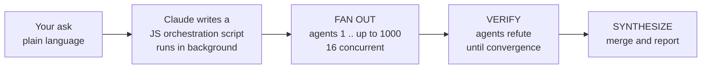
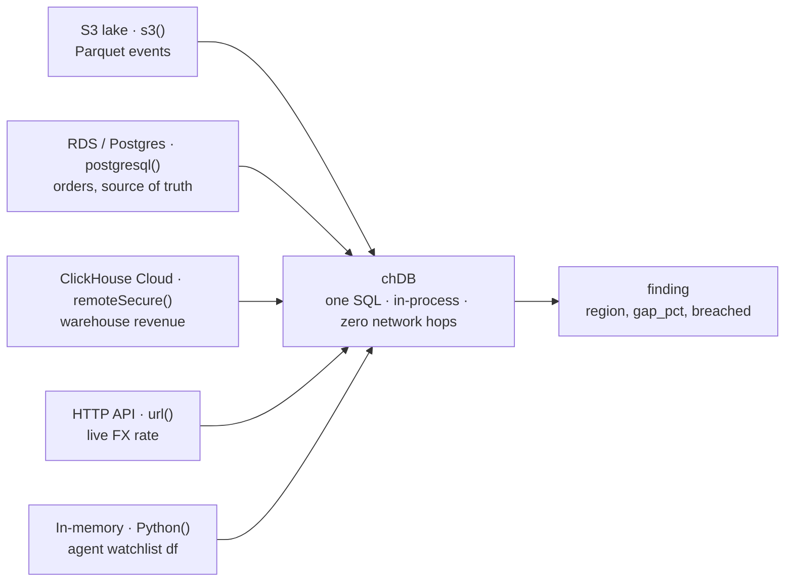

# Give every agent its own analytical engine: chDB and Claude Dynamic Workflows

> Claude can now run a thousand agents on one task. This is how to make each of them a federated SQL engine that joins S3, Postgres, ClickHouse, an HTTP API, and an in-memory DataFrame in a single query, with no servers to stand up.

**What you'll learn:** how to make each subagent in a Claude Dynamic Workflow a federated chDB query that joins S3, Postgres, ClickHouse, an HTTP API, and an in-memory DataFrame in one statement, with no server to stand up.

---

## 1. What Dynamic Workflows actually does

Claude Code recently shipped Dynamic Workflows, and it raises the ceiling on what one request can finish.

Until now, an agent did its thinking inside one context window. Big jobs hit a wall: too many files, too many sources, too much to hold at once. Dynamic Workflows gets past that. You describe the job in plain language, Claude writes a JavaScript orchestration script, and a background runtime executes it. The work fans out across tens to hundreds of parallel subagents, up to 1,000 per run with 16 running at a time. The plan lives in code rather than the context window, intermediate results sit in script variables, and independent agents try to refute each other's findings, iterating until the answers agree before anything comes back to you.

> That last part is what people are reacting to. This is the gap between "summarize this file" and "audit this entire estate." Early use lands on the jobs that never fit before: codebase-wide bug hunts, security audits, and migrations that span thousands of files from start to finish, planned and parallelized and checked.

The shape underneath is always the same three beats:



A thousand hands on one problem. So the next question is what you put in each hand.

---

## 2. Where chDB and Dynamic Workflows meet

Dynamic Workflows is at its best when a job breaks into many independent units, and a large share of those units are data work:

- Reconcile a metric across systems for every region, tenant, or cohort.
- Audit thousands of Parquet files, tables, or feeds for schema drift, freshness, or PII.
- Profile and catalog a whole data lake, one dataset per agent.
- Check a warehouse aggregate against the transactional source of truth.

Each of these is a fan-out where every subagent has to run real analytical SQL, often across more than one source. That is the point where most data stacks get painful. You provision a warehouse, install a handful of connectors, broker credentials, and hope your shared database survives a thousand agents hitting it at once.

chDB was built for this seam. An agent does not need a database, it needs a query that runs now. chDB gives each subagent its own embedded analytical engine, a `pip install` with no server and no daemon, that federates across sources in a single statement and then disappears.

> A framing worth borrowing: an agent is not a chatbot. A chatbot makes one model call. An agent makes many tool calls per turn, and every network hop to a database adds latency the user feels. chDB folds that into one in-process engine, so data access becomes a function call bounded by CPU rather than the network.

---

## 3. Why chDB's strengths line up with Dynamic Workflows

Put the two next to each other and they match almost point for point:

| Dynamic Workflows wants | chDB gives |
|---|---|
| Large fan-out (up to 1000 agents) | each agent its own engine, so there is no shared server to overload and no connection pool to exhaust |
| Ephemeral subagents (start, work, discard) | a library, not a daemon: open, federate, return, vanish, with nothing running between calls |
| Many sources per unit of work | one SQL statement across S3, Postgres, ClickHouse, HTTP, and in-memory DataFrames |
| Speed, because latency compounds across agents | in-process with no network round-trips, so insight is bounded by CPU |
| Run anywhere a background runtime puts it | a `pip install`-sized native library that drops into serverless compute and scales to zero by nature |
| A path beyond local | the same SQL points at ClickHouse Cloud through `remoteSecure()` when the working set outgrows local, with no rewrite |

The line that matters at fan-out scale is the first one. A client-server warehouse cannot do this. Point a thousand ephemeral agents at one database and you get connection-pool exhaustion and a bad night for whoever is on call. Give each agent an in-process chDB and the only limit is how fast your sources can serve reads, because there is no shared engine left to fall over.

> The warehouse is where your data lives. chDB is what your agent thinks with. They work together: chDB federates to the warehouse for the long tail and joins it locally with everything else.

---

## 4. The example: a federated revenue-integrity sweep

Here is a concrete one. A marketplace closes its books nightly and, for every region, has to answer a single question:

> Does the revenue our warehouse reports match the source-of-truth orders, normalized to USD at today's FX rate, within that region's tolerance?

The data sits in five different systems, and chDB joins all five in one query, per region, in one process:



### 4.1 The query: one statement, five sources (`audit_region.py`)

This is what each subagent runs for its region. Every line is current chDB syntax, verified against chDB 4.1.8.

```python
# audit_region.py: one federated chDB query == one region's revenue-integrity check
import os, sys, chdb

REGION = sys.argv[1]                                   # e.g. "EU"
CCY    = {"EU":"EUR","US":"USD","APAC":"JPY","LATAM":"BRL"}[REGION]

# A DataFrame the agent already holds in memory (e.g. tonight's watchlist).
# Tip: chDB ships a drop-in pandas replacement (`import chdb.datastore as pd`),
# so you can build/manipulate this with the pandas API and no real pandas dependency.
import chdb.datastore as pd
watchlist = pd.DataFrame({"region": ["EU", "APAC"], "reason": ["flagged", "new-market"]})
watchlist = watchlist.to_pandas()                      # Python() reads pandas / Arrow

sql = f"""
WITH
  -- (HTTP) live exchange rate, fetched at query time
  fx AS (
    SELECT JSONExtractFloat(line, 'rates', '{CCY}') AS ccy_per_usd
    FROM url('https://api.frankfurter.app/latest?from=USD&to={CCY}', 'LineAsString') AS t(line)
    SETTINGS max_http_get_redirects = 5
  ),
  -- (Postgres) source-of-truth revenue              # production wiring
  src AS (
    SELECT sum(amount) AS rev_local
    FROM postgresql('{os.environ.get("PG_DSN","")}', 'orders')
    WHERE region = '{REGION}' AND order_date = today() - 1
  ),
  -- (ClickHouse) reported revenue from the warehouse  # production wiring
  wh AS (
    SELECT sum(revenue) AS rev_local
    FROM remoteSecure('{os.environ.get("CH_HOST","")}', 'analytics.daily_revenue',
                      '{os.environ.get("CH_USER","")}', '{os.environ.get("CH_PASSWORD","")}')
    WHERE region = '{REGION}' AND day = today() - 1
  ),
  -- (S3) event-volume sanity check from the Parquet lake  # production wiring
  lake AS (
    SELECT count() AS purchase_events
    FROM s3('{os.environ.get("EVENTS_LAKE","").replace("REGION", REGION)}', 'Parquet')
    WHERE event_type = 'purchase'
  )
SELECT
  '{REGION}'                                                       AS region,
  round(src.rev_local / fx.ccy_per_usd, 2)                        AS src_usd,
  round(wh.rev_local  / fx.ccy_per_usd, 2)                        AS wh_usd,
  round(100 * abs(wh.rev_local - src.rev_local)
            / nullIf(src.rev_local, 0), 3)                        AS gap_pct,
  lake.purchase_events                                            AS purchase_events,
  -- per-region tolerance, inline & native, no DataFrame needed
  (SELECT max_gap_pct FROM values('region String, max_gap_pct Float64',
        ('EU',2.0),('US',1.5),('APAC',3.0),('LATAM',4.0))
     WHERE region = '{REGION}')                                   AS tolerance_pct,
  -- (Python) is this region on tonight's watchlist?
  '{REGION}' IN (SELECT region FROM Python(watchlist))            AS on_watchlist,
  gap_pct > tolerance_pct                                         AS breached
FROM src, wh, lake, fx
"""

print(chdb.query(sql, "JSONEachRow"), end="")          # one JSON row → the agent's finding
```

Five systems, one SQL statement, one process. There is no ETL job, no server kept running, and no connectors to install.

### 4.2 The Dynamic Workflow that drives it

This is the kind of script Claude generates from "run tonight's revenue-integrity sweep across all regions." Each `agent(...)` is a subagent that runs `audit_region.py` and returns a structured finding. Flagged regions get re-checked before anything reaches the report.

```javascript
export const meta = {
  name: 'revenue-integrity-sweep',
  description: 'Federated nightly revenue-integrity audit across regions; chDB per agent',
  phases: [
    { title: 'Audit',      detail: 'one chDB federated query per region' },
    { title: 'Verify',     detail: 'adversarially refute each flagged anomaly' },
    { title: 'Synthesize', detail: 'merge confirmed anomalies into a report' },
  ],
}

const REGIONS = ['EU', 'US', 'APAC', 'LATAM']          // the fan-out work-list
const FINDING = { type: 'object', properties: {
  region: {type:'string'}, gap_pct:{type:'number'}, breached:{type:'boolean'} },
  required: ['region','gap_pct','breached'] }
const VERDICT = { type: 'object', properties: {
  region:{type:'string'}, confirmed:{type:'boolean'}, note:{type:'string'} },
  required: ['region','confirmed'] }

// pipeline(): each region flows AUDIT → (if breached) VERIFY independently, no barrier.
const results = await pipeline(
  REGIONS,
  (region) => agent(
    `Run the revenue-integrity check for "${region}": python3 audit_region.py ${region}
     Return the single JSON finding it prints. Do not edit the SQL.`,
    { label: `audit:${region}`, phase: 'Audit', schema: FINDING }),
  (finding, region) => {
    if (!finding || !finding.breached) return finding   // clean region → skip verify
    return agent(
      `Region "${region}" looks breached (gap ${finding.gap_pct}%). Try to REFUTE it:
       re-run day-by-day for the last 7 days (one chDB query, GROUP BY day). A single-day
       blip is late-arriving orders; default confirmed=false unless the gap persists ≥2 days.`,
      { label: `verify:${region}`, phase: 'Verify', schema: VERDICT }
    ).then(v => ({ ...finding, verdict: v }))
  }
)

const confirmed = results.filter(Boolean)
  .filter(r => r.breached && r.verdict && r.verdict.confirmed)
const report = await agent(
  `Write a concise nightly revenue-integrity report from these confirmed anomalies:
   ${JSON.stringify(confirmed)}: region, USD gap, likely cause, suggested owner.
   If empty, say "all regions reconciled within tolerance."`,
  { label: 'synthesize', phase: 'Synthesize' })

return { regions: REGIONS.length, confirmed: confirmed.length, report }
```

Change one array, `REGIONS` to 4,000 seller cohorts, and the same script scales the sweep by three orders of magnitude. The runtime handles concurrency at 16 at a time and the cap at 1,000 agents.

### 4.3 Every federation leg, verified live

These ran against live sources while writing this cookbook (chDB 4.1.8):

```text
Python(df)  in-process DataFrame   → "APAC",3   "EU",2   "US",1.5
Python ⋈ values()  one SQL         → "APAC","new-market",3   "EU","flagged",2
url()  live FX (frankfurter.app)   → usd_eur 0.85866, date "2026-06-01"
remoteSecure()  public ClickHouse  → sum(number) = 10   (connected, authed, executed remotely)
values()  native inline config     → "APAC",3 | "EU",2 | "LATAM",4 | "US",1.5
```

In one query, a single chDB process read an in-memory DataFrame, an inline config, a live HTTP API, and a remote ClickHouse cluster. No servers started, no connectors installed.

---

## 5. One rule before you fan out: sandbox the engine

A federated chDB tool can reach `s3()`, `url()`, `file()`, and more, which means arbitrary filesystem and outbound network access. Across a thousand agents running partly LLM-authored SQL, that surface matters. Gate it:

- Run read-only with `SET readonly = 2`, which still allows the federation table functions you need.
- Enforce a table-function allowlist (permit `s3`, `url`, `postgresql`, `remote`, `file`, and block code-exec functions from untrusted SQL) and a path allowlist.
- Isolate each agent behind a per-tenant boundary or microVM.

A bare "run any SQL" tool ships none of these guards, so confirm your tool layer adds them before you expose federation to a fan-out.

---

## 6. The takeaway

Dynamic Workflows gives you a thousand hands. chDB puts a federated analytical engine in each one, with no server to provision, no pool to exhaust, five sources in a single query, and nothing left running once the agent is done. The two fit together well.

```bash
pip install chdb        # that is the entire setup
```

### Appendix: run the verified pieces yourself

```python
import chdb
import chdb.datastore as pd                      # drop-in pandas replacement (no real pandas needed)
watch = pd.DataFrame({"region": ["EU","APAC"], "reason": ["flagged","new"]}).to_pandas()

# in-memory DataFrame  ⋈  native inline config, one SQL
print(chdb.query("""
  SELECT w.region, w.reason, c.max_gap_pct
  FROM Python(watch) w
  JOIN values('region String, max_gap_pct Float64',
              ('EU',2.0),('US',1.5),('APAC',3.0)) c ON w.region = c.region
  ORDER BY w.region""", "CSV"))

# live HTTP federation
print(chdb.query("""
  SELECT JSONExtractFloat(line,'rates','EUR') usd_eur, JSONExtractString(line,'date') d
  FROM url('https://api.frankfurter.app/latest?from=USD','LineAsString') AS t(line)
  SETTINGS max_http_get_redirects=5""", "CSV"))

# remote ClickHouse federation
print(chdb.query(
  "SELECT sum(number) FROM remoteSecure('sql-clickhouse.clickhouse.com', numbers(5), 'demo','')",
  "CSV"))
```
</content>

---

**Try next:** swap the `REGIONS` array for your own work-list, point the `postgresql()`/`remoteSecure()`/`s3()` sources at your data, and run the workflow. For the in-process pandas angle, see the [chDB DataStore guide](https://clickhouse.com/docs/chdb).
